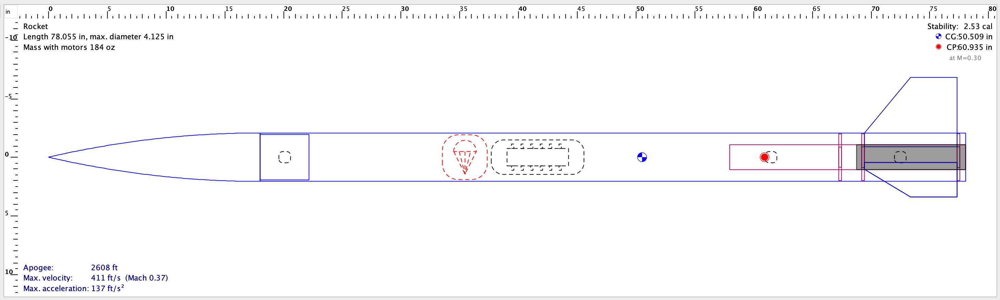
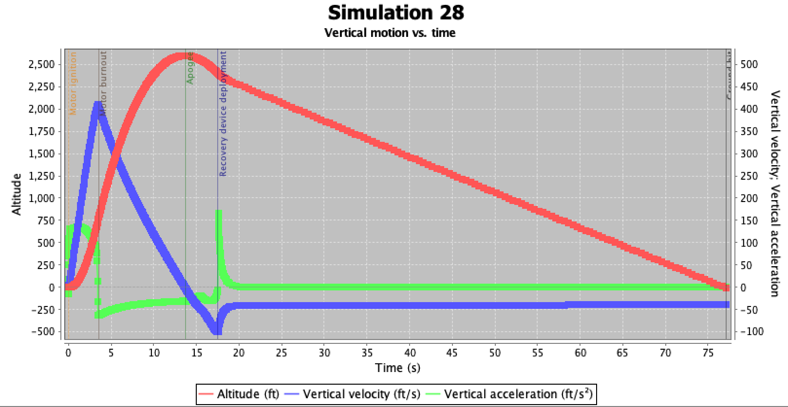
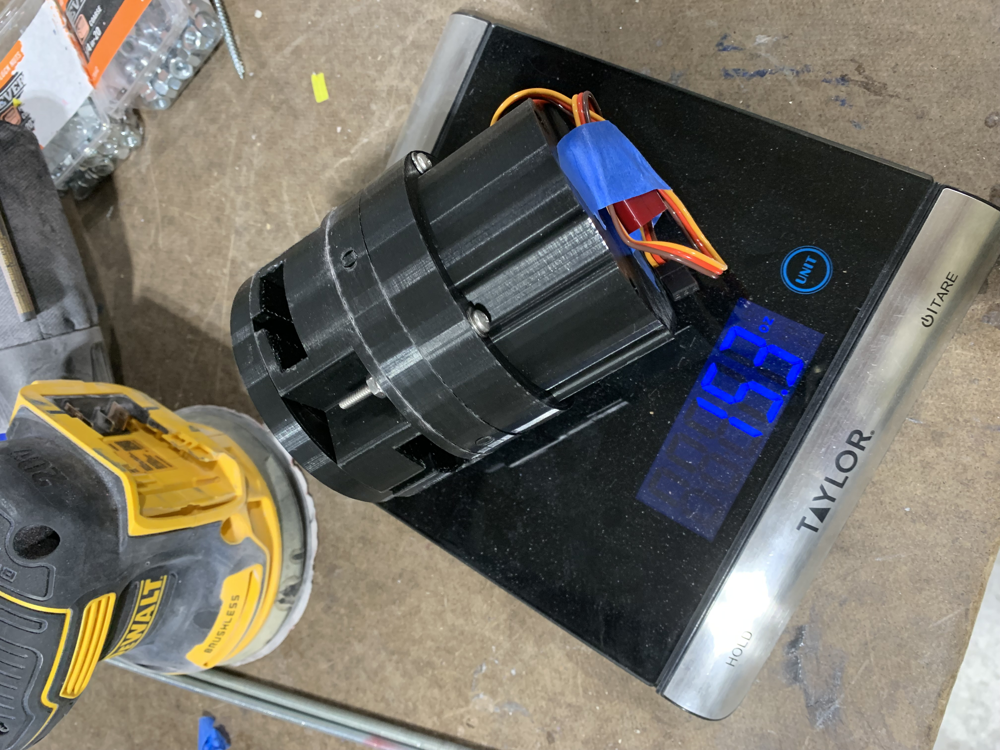

# Rocketry Project

## Table of Contents
- [Introduction](#introduction)
- [Flight Software](#flight-software)
- [PCB Design](#pcb-design)
- [OpenRocket](#openrocket)
- [CAD](#cad)
- [Installation](#installation)

## Introduction
This project is focused on the development of an active drag system, or air brake, for a model rocket. This project demonstrates the designs of the various components, including the flight software, printed circuit board (PCB), OpenRocket analysis for the vehicle, and CAD drawings for the system. 
Due to time constraints, the vehicle was never flown with an active drag system installed.

## Flight Software
### Overview
The `Arduino Codes` directory contains the code necessary for controlling the rocket's Active Drag System. This system adjusts the rocket's drag tabs based on readings from an altimeter and accelerometer to control the rocket's apogee. The system is controlled before launch using a Bluetooth module that can connect to a user's phone, allowing for the constant monitoring of flight readiness once the system is installed in the vehicle. Data is redundantly saved to an onboard flash memory chip and SD for storage and post-flight analysis.

### Block Diagram


### Description
The flight software implements a state machine to manage the deployment of drag tabs in the Active Drag System. This system actively modulates the drag during flight to achieve a desired apogee by processing real-time data from the altimeter and accelerometer. The state machine ensures that the drag tabs are deployed or retracted based on the rocket's altitude and acceleration, thus controlling the peak altitude accurately.

## PCB Design
### Overview
The `PCB Design` directory contains all the files related to the design and manufacturing of the rocket's printed circuit boards (PCBs). These PCBs are used to integrate the electronic components necessary for the rocket's operation.

### Images


### Description
PCB design is crucial for ensuring that the electronic components are securely mounted and connected properly. The files in this directory include design files, Gerber files for manufacturing, and images showing different layers and the schematic of the PCB.

### Design Highlights
- `boardFinal.brd`: The final PCB design file.
- `schematic.png`: Image of the schematic layout for the PCB.

## OpenRocket
### Overview
The `OpenRocket` directory contains simulation files for the rocket. These files can be used to simulate the rocket's flight characteristics and performance.

### Images



### Description
OpenRocket is a model rocket simulator that allows you to design and simulate the performance of rockets. The model in this directory represents the vehicle design as well as detailed simulations that help in predicting the flight path, stability, and performance of the vehicle.

## CAD
### Overview
The `CAD` directory contains the design files for the system's structural components. This model was created in SolidWorks, and the files can be used to fabricate the parts using 3D printing.

### Images
 
 
 



### Description
FEA (finite element analysis) and CFD (computational fluid dynamics) were performed on the system to evaluate both its structural integrity and effectiveness as a braking system.

## Installation
To install the software and code for this project, follow these steps:

1. Clone the repository:
   ```bash
   git clone https://github.com/willpb33/Active-Drag-System